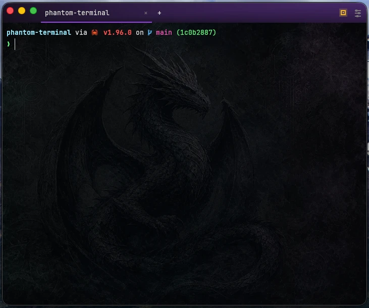

# Phantom Terminal

Phantom Terminal is a minimal desktop terminal that remembers your tabs.
It is a native Rust app: a `winit` window with a hand-rolled `wgpu` renderer for
the terminal grid, `egui` for settings and panels, and `alacritty_terminal` as
the VT core. No webview, no web stack.



## Features

- It's a terminal app.
- Horizontal or vertical tab layouts, custom tab names, and keyboard shortcuts.
- Theme, font, cursor, shell profile, and session settings.
- Scrollback is memory-only, nothing gets written to disk except settings.

## Why

I wanted a simple terminal that remembers tabs and the CWD of each tab.

## Requirements

- A stable Rust toolchain with `cargo`.
- On Linux, the usual `winit` build dependencies (X11/Wayland/xkbcommon client
  headers), e.g. on Debian/Ubuntu:

  ```sh
  sudo apt-get install -y libxkbcommon-dev libwayland-dev libx11-dev \
    libxcursor-dev libxi-dev libxrandr-dev libgl1-mesa-dev
  ```

## Development

Run the app:

```sh
cargo run -p phantom-app
```

Launch a fresh, non-remembering window in a specific directory:

```sh
cargo run -p phantom-app -- --cwd /path/to/project
```

Installed builds accept the same `--cwd` launch mode:

```sh
phantom --cwd /path/to/project
```

`--cwd` launches use your normal settings, but they do not restore remembered
tabs and do not update remembered tab state. Without `--cwd`, Phantom also
starts in non-remembering mode when it is launched from a non-home, non-root
working directory. Use `--normal` to force the usual remembered-tabs launch:

```sh
phantom --normal
```

## Build & Install Locally

Phantom Terminal does not include a network auto-updater. To update an installed
copy, pull or switch to the source you want, then build and install that
checkout with one OS-detecting script (no Bun, no Node — just `cargo` and the OS
tools):

```sh
git pull
./scripts/install-native.sh
```

- **macOS** — assembles `Phantom Terminal.app` around the `phantom` binary, gives
  it the app icon, ad-hoc signs it, and installs it to
  `/Applications/Phantom Terminal.app`. It also writes a drag-to-Applications
  `.dmg` to `target/native-bundle/` for archiving. Ad-hoc signing is all a
  personal, locally-built app needs — no Apple Developer ID and no notarization.
- **Linux** — installs the `phantom` binary, the icon (into the hicolor theme),
  and a `.desktop` entry under `~/.local`. The committed entry is
  [`crates/phantom-app/linux/phantom.desktop`](crates/phantom-app/linux/phantom.desktop).
  Desktop environments that use `xdg-terminal-exec` can select it with the
  desktop id `phantom.desktop`; its `X-TerminalArgDir=--cwd` metadata is used for
  cwd-specific, ephemeral launches.

Useful variants:

```sh
./scripts/install-native.sh --no-install   # build only, leave artifacts in target/
./scripts/install-native.sh --no-dmg       # macOS: skip the .dmg
INSTALL_DIR="$HOME/Applications" ./scripts/install-native.sh   # install elsewhere
```

## Checks

```sh
cargo fmt --all --check
cargo clippy --all-targets --locked -- -D warnings
cargo build --workspace --locked
cargo test --workspace --locked
bash scripts/check-no-network.sh
```

## License

Phantom Terminal is released under the MIT License. See [LICENSE](LICENSE).
