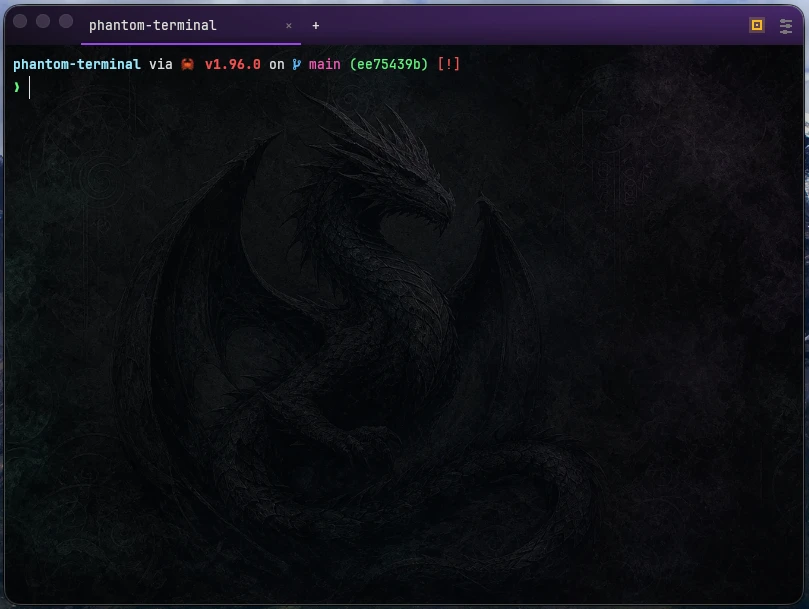

# Phantom Terminal

Phantom Terminal is a minimal desktop terminal that remembers your tabs.
It is built with Tauri 2, Rust, React 19, TypeScript, Vite, and Bun.
It's basically a wrapper around ghostty-web.



## Features

- It's a terminal app.
- Horizontal or vertical tab layouts, custom tab names, and keyboard shortcuts.
- Theme, font, cursor, shell profile, and session settings.
- Scrollback is memory-only, nothing gets written to disk except settings.

## Why

I wanted a simple terminal that remembers tabs and the CWD of each tab.

## Requirements

- [Bun](https://bun.sh) 1.3.9 or newer.
- A stable Rust toolchain with `cargo`.
- Tauri platform dependencies. See the
  [Tauri prerequisites](https://tauri.app/start/prerequisites/).

Install JavaScript dependencies:

```sh
bun install
```

## Development

Run the hot-reloading desktop app:

```sh
bun run tauri dev
```

Launch a fresh, non-remembering window in a specific directory:

```sh
bun run tauri dev -- -- /path/to/project
```

Installed builds also accept `/path/to/project`, `--cwd /path/to/project`, and
`--working-directory /path/to/project`. Those launches use your normal settings,
but they do not restore remembered tabs and do not update remembered tab state.

Build the frontend:

```sh
bun run build
```

## Update Local Install

Phantom Terminal does not include a network auto-updater. To update an installed
copy, pull or switch to the source you want, then build and install that checkout:

```sh
git pull
bun run update
```

Useful variants:

```sh
bun run update -- --no-install
INSTALL_DIR="$HOME/Applications" bun run update
```

On macOS, the local install script ad-hoc signs the app and removes the
quarantine flag for the rebuilt bundle.

On Linux, the local install script also writes
`~/.local/share/applications/com.phantom.terminal.desktop` with terminal-emulator
metadata. Desktop environments that use `xdg-terminal-exec` can select it with
the desktop id `com.phantom.terminal.desktop`.

## License

Phantom Terminal is released under the MIT License. See [LICENSE](LICENSE).
